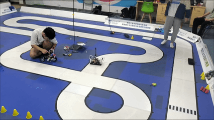
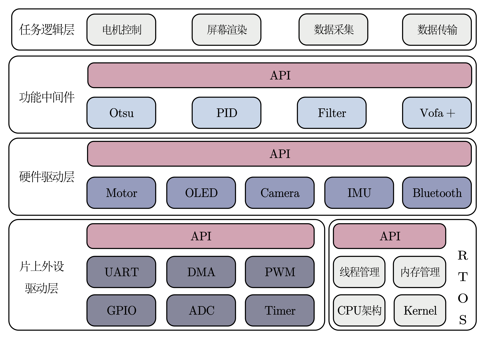
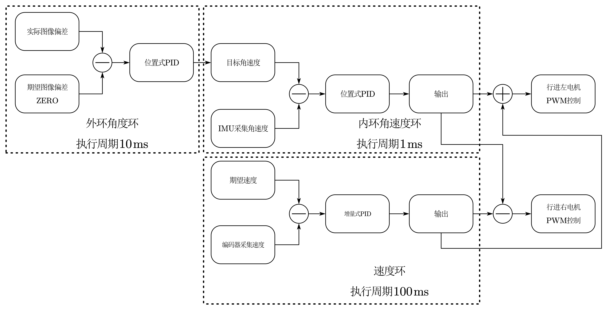

# 基于 RISC-V 气垫船控制系统：嵌入式系统实践

<div align="center">
  
[](https://github.com/JoinNico/Hovercraft_Control_System/stargazers)
[](https://www.gnu.org/licenses/gpl-3.0)
[](https://www.wch.cn/products/CH32V307.html)
[](https://www.freertos.org/)

</div>


**第十九届全国大学生智能汽车竞赛参赛作品** | **一个完整的高性能实时控制系统实现**

<div align="center">
  

  **气垫船运行效果演示**
</div>

> **✨亮点速览**：这是**我和我的团队**构建的气垫船控制系统，采用沁恒微电子公司的 CH32V307 + FreeRTOS，实现了气垫船的**全向精准控制**。不仅“能动”，还有不错的 **速度、角度控制精度**。下面，我将带你深入这个硬核而优雅的嵌入式系统世界。

## **为什么这个项目值得制作、被开源？**
### **技术栈的完整实践**
- **前沿架构**：基于**RISC-V**生态的CH32V307，探索国产芯片+开源指令集的可能性
- **实时系统**：**FreeRTOS**多任务调度，可以实时性地完成任务控制
- **算法深度**：从电机**无感驱动**到运动**串级PID控制**的全链路实现（这里要感谢逐飞科技的大力开源）
- **工程完备**：硬件设计→固件开发→算法调试→系统集成的完整闭环

### **从理论到实战的跨越**
这不是一个简单的“点灯Demo”，而是一个实际参加了竞赛、解决了真实工程挑战的项目。我和我的团队一起面对并攻克了：
- **实时性保障**：在144MHz的RISC-V核心上优化FreeRTOS任务调度
<!-- falsh的保存卡死问题 -->
- **控制精度**：在无传感器条件下实现稳定的电机驱动和姿态控制
<!-- 日复一日的实验室调试 -->
- **系统集成**：将传感器、执行器、人机交互有机整合为可靠系统
<!-- 一个“能动”的系统 -->
---

## 项目结构
```
Hovercraft_Control_System/
├── README.md
├── Tools/          # 测试工具和辅助软件
├── Document/       # 技术文档和芯片手册
├── Firmware/       # 嵌入式固件和驱动程序
└── Hardware/       # 电路原理图和PCB设计
```
---
## **技术架构深度解析**
### **智能控制核心**

#### 系统架构概览

本系统采用一套分层化、模块化的软件架构，自顶向下划分为业务逻辑层、功能中间件层、硬件驱动层以及片上外设驱动层，层间通过标准化 API 接口实现解耦，确保系统的高内聚低耦合特性。

在**业务逻辑层**，我们构建了基于视觉的图像识别模块与实时元素决策模块，前者通过摄像头采集环境信息并识别关键航路点与障碍物，后者则依据识别结果、IMU姿态数据以及预设航迹规划，通过串并级 PID 算法生成精确的电机控制指令。同时，该层集成了用户交互（UI菜单）与数据传输（蓝牙）功能，实现了控制指令下发与船体状态信息的双向通信。

在**功能中间件层**，我们整合了包括 OTSU 图像二值化、数字滤波器、PID控制器以及VOFA+上位机调试协议在内的核心算法库与工具集，为上层业务提供高效的计算与通信支持。

在**硬件驱动层**，逐飞科技对电机、OLED显示屏、摄像头、IMU 等外设进行了统一的
抽象与封装，提供了稳定可靠的设备操作接口。

在**片上外设驱动层**，沁恒微电子对 CH32V307 的片上外设驱动做了详细的封装，提供了标准化的外设库函数，涵盖 UART、GPIO、DMA、PWM、ADC、Timer 等核心模块。

### **关键技术实现**
1. **无刷电机无感驱动**（由逐飞科技提供）
   - 基于反电动势过零检测的方波驱动算法
   - 启动策略优化：三段式启动（预定位→加速→闭环）

2. **串级PID运动控制**

```c
   // 简化的控制逻辑 - 伪代码

   /* 外环输入：摄像头采集的图像 -> 进行图像分析 -> 得出的误差
    * 外环输出：外环PID值
    */
   outer_loop = pid_calc(&image_pid, target_image, actual_image);
   /* 内环输入：外环输出-PID值
    * 内环输出：changePWM -> 控制电机转速
    */
   inner_loop = pid_calc(&angular_velocity_pid, outer_loop, actual_angular_velocity);

   /* 速度环输入：编码器实际采集到的速度
    * 速度环输出：basePWM -> 控制电机 基准 转速
    */
   speed_loop = pid_calc(&speed_pid, target_speed, actual_speed);

   // 基准速度 + 内环输出 -> 控制电机 PWM 变化 -> 电机转速变化
   motor_output = constrain(speed_loop + inner_loop, -MAX_PWM, MAX_PWM);
```
1. **FreeRTOS任务设计**
<!-- /* 1. 避免优先级反转 */
// 高优先级任务不应长时间阻塞
// 使用信号量、互斥量时要小心

/* 2. 考虑CPU负载 */
// 高优先级任务过多会导致低优先级任务"饿死"
// 确保总CPU占用率 < 70-80%

/* 3. 你的设计建议 */
// 当前设计合理，但注意：
// - 电机控制(1ms)是否真的需要这么高频率？
// - 业务逻辑(20ms)是否可能阻塞其他任务？ -->
我们采用硬实时中断触发 + 任务级软分频的混合架构。针对气垫船控制的特点，将系统划分为四个优先级分明的任务。

| 任务名称 | 优先级 |  触发方式 | 功能描述 |
|:--------:|:------:|:---------|:---------|
| **Control_Task** | 最高 | TIM6 1ms 任务通知 | 硬实时控制环：IMU 姿态解算、利用 PID 对 PWM 计算、电机驱动 |
| **Perception_Task** | 次高 | 摄像头场中断通知 | 图像处理：赛道识别、边线提取、路径决策 |
| **System_Task** | 次低 | vTaskDelayUntil 100ms | 系统监控：电池电压采集、状态更新 |
| **UI_Task** | 最低 | vTaskDelayUntil 40ms | 人机交互：LCD 刷新、编码器扫描、菜单响应 |

既保证 1ms 控制环的严格实时性，又兼顾图像处理、UI 响应等复杂功能的执行效率。

## 快速开始

### 1. 环境搭建
1. **安装开发环境**：MountRiver Studio (MRS)
2. **配置工具链**：RISC-V GCC 编译工具链
3. **准备调试器**：WCH-LinkE 调试编程器

### 2. 编译烧录
```bash
# 克隆项目
git clone https://github.com/JoinNico/Hovercraft_Control_System.git
# 导入工程到 MRS
# 配置编译选项
# 连接硬件并烧录程序
```
### 3. 基础测试 
<!-- 逐飞有写assert，你可以看到出问题的系统 -->
1. **MCU测试**：上电后观察RGB LED状态（应显示系统状态）
2. **屏幕按键测试**：旋转EC11编码器浏览四级菜单
3. **电机测试**：在“ Motor Test ”菜单中尝试控制单个电机
4. **传感器测试**：查看显示屏上的实时传感器数据
   
### 4. 系统调试
1. **参数整定**：使用配套上位机工具调整 PID 参数
2. **数据监控**：通过串口实时监控系统运行状态
3. **性能测试**：分模块测试各功能单元性能指标

---

<!-- ## 参与贡献

我们欢迎各种形式的贡献，包括但不限于：

- **问题反馈**：提交 Issue 报告发现的 Bug
- **功能建议**：提出新功能或改进建议
- **代码贡献**：提交 Pull Request 改进代码
- **文档完善**：帮助完善项目文档和使用教程
- **技术研究**：参与算法优化和性能提升

### 贡献流程
1. Fork 本仓库到你的账户
2. 创建功能分支 (`git checkout -b feature/AmazingFeature`)
3. 提交更改 (`git commit -m 'Add some AmazingFeature'`)
4. 推送到分支 (`git push origin feature/AmazingFeature`)
5. 开启 Pull Request -->

---

## 致谢

- **全国大学生智能汽车竞赛组委会** - 提供宝贵的竞赛平台和学习机会
- **南京沁恒微电子股份有限公司** - 提供 CH32V307 RISC-V 芯片技术支持和开发工具
- **成都逐飞科技有限公司** - 提供完善的 CH32V307 软件库和硬件设计参考
- **DeepSeek 等 AI 大模型** - 提供随时随地的技术解答和润色那刻板印象般的文字

### 特别感谢
感谢所有为项目做出贡献的老师和同学们，你们的辛勤付出和智慧结晶成就了这个项目！

---

<!-- ## 联系我们

**这个项目对我而言，是嵌入式系统学习路上的重要里程碑。如果你：**
- 对RISC-V或FreeRTOS感兴趣
- 正在准备嵌入式相关竞赛
- 想探讨电机控制算法
- 有任何改进建议

欢迎通过以下方式联系我：

- **邮箱**：joenikon04@gmail.com
- **Issues**：[项目 Issues 页面](https://github.com/JoinNico/Hovercraft_Control_System/issues)
- **主页**：[项目主页](https://github.com/JoinNico/Hovercraft_Control_System) -->

---
<div align="center">

**如果这个项目对你有启发，请给个⭐️ Star支持！**  
**你的认可是我继续开源优质项目的最佳动力。**

</div>

**最后更新：2026年3月 | 持续维护中...**